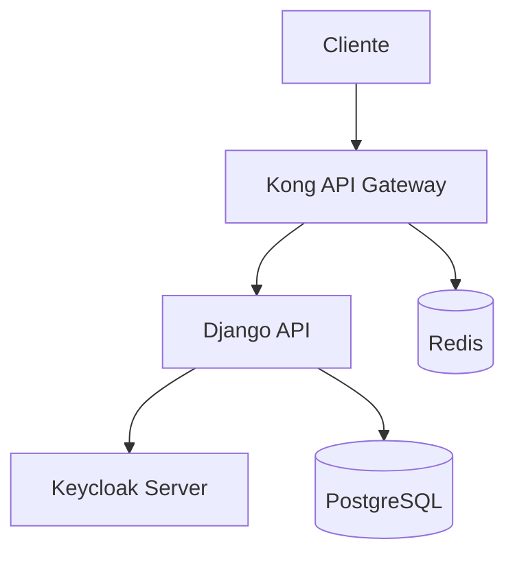

# Documentação - Autenticação Keycloak + Kong

Esta pasta contém toda a documentação necessária para configurar e usar este projeto como boilerplate para autenticação agnóstica com Keycloak e Kong API Gateway.

## 📚 Documentos Disponíveis

### 🚀 [Setup Principal](./KEYCLOAK-KONG-SETUP.md)

Guia completo de configuração inicial para novos projetos.

**Conteúdo:**

- Arquitetura de autenticação
- Configuração do Keycloak
- Setup do Kong API Gateway
- Variáveis de ambiente
- Classes de autenticação
- Middleware Kong
- Testes de configuração

### 🛠️ [Troubleshooting](./TROUBLESHOOTING.md)

Soluções para problemas comuns.

**Conteúdo:**

- Problemas de autenticação
- Issues com Kong Gateway
- Conectividade Keycloak
- Performance e otimização
- Scripts de diagnóstico

## 🏗️ Arquitetura do Sistema



### Fluxo de Autenticação

1. **Cliente** envia request com JWT token
2. **Kong** aplica rate limiting e routing
3. **Django** valida token com Keycloak
4. **Keycloak** confirma validade do token
5. **Django** cria/atualiza usuário automaticamente
6. **Response** é enviada de volta

## 🔧 Componentes Principais

### Autenticação

- `nitapi/authentication.py` - Backend Keycloak
- `nitapi/drf_authentication.py` - Classes DRF
- `nitapi/kong_middleware.py` - Middleware Kong

### Configurações

- `nitapi/settings/base.py` - Settings principais
- `.django` - Variáveis de ambiente

### Modelos

- `apps/users/models.py` - User estendido com keycloak_id

## 📝 Como Usar Este Boilerplate

### Para Novo Projeto

1. Clone este repositório
2. Siga o [Setup Principal](./KEYCLOAK-KONG-SETUP.md)
3. Configure suas variáveis de ambiente
4. Execute as migrations
5. Configure Keycloak e Kong

### Para Projeto Existente

1. Siga o [Guia de Migração](./MIGRATION-GUIDE.md)
2. Faça backup do banco de dados
3. Execute as migrations incrementalmente
4. Teste cada etapa

### Em Caso de Problemas

1. Consulte o [Troubleshooting](./TROUBLESHOOTING.md)
2. Execute os scripts de diagnóstico
3. Verifique logs detalhados
4. Use o checklist de verificação

## 🔐 Segurança

### Considerações Importantes

- **Nunca** exponha client secrets em logs
- Use HTTPS em produção
- Configure CORS adequadamente
- Implemente rate limiting
- Monitore tentativas de acesso

### Variáveis Sensíveis

```bash
# Sempre proteja estas variáveis
KEYCLOAK_CLIENT_SECRET=
KEYCLOAK_ADMIN_PASSWORD=
DJANGO_SECRET_KEY=
```

## 🚦 Ambientes

### Desenvolvimento

- Keycloak local via Docker
- Kong local via Docker Compose
- Django runserver
- PostgreSQL local

### Produção

- Keycloak via Docker em servidor separado
- Kong no servidor das APIs com load balancer
- Django com Gunicorn + Nginx
- PostgreSQL com replica

## 📊 Monitoramento

### Métricas Recomendadas

- Taxa de autenticação bem-sucedida
- Tempo de resposta de autenticação
- Uso de recursos Kong/Keycloak
- Erros de validação de token

### Logs Importantes

```python
# Django
LOGGING = {
    'loggers': {
        'nitapi.authentication': {'level': 'INFO'},
        'nitapi.kong_middleware': {'level': 'INFO'},
    }
}
```

### Alertas Sugeridos

- Falhas de autenticação > 5%
- Tempo de resposta > 2s
- Keycloak/Kong indisponível
- Rate limiting atingido

## 🔄 Atualizações

### Controle de Versão

Este boilerplate segue versionamento semântico:

- **Major**: Mudanças que quebram compatibilidade
- **Minor**: Novas funcionalidades
- **Patch**: Correções de bugs

### Changelog

Principais mudanças são documentadas em:

- Git tags para versões
- Commits descritivos
- Issues para bugs reportados

## 🤝 Contribuição

### Como Contribuir

1. Fork do repositório
2. Crie branch para feature
3. Implemente mudanças
4. Adicione testes
5. Atualize documentação
6. Envie Pull Request

### Padrões de Código

- PEP 8 para Python
- Type hints quando possível
- Docstrings para funções públicas
- Testes para novas funcionalidades

### Documentação Adicional

- [Patterns](./patterns/) - Padrões de desenvolvimento
- [SQL](./sql/) - Documentação de banco
- [Storage](./storage/) - Configuração de storage

Para dúvidas específicas:

1. Consulte esta documentação
2. Verifique issues existentes
3. Crie nova issue se necessário

### 🛠️ [Setup Docker](./DOCKER-SETUP.md)

Configuração completa usando Docker para desenvolvimento.

**Conteúdo:**

- Docker Compose para Keycloak + Kong
- Scripts de inicialização automatizada
- Configuração de desenvolvimento local
- Troubleshooting Docker

### ⚙️ [Exemplos de Configuração](./CONFIGURATION-EXAMPLES.md)

Exemplos completos para diferentes ambientes.

**Conteúdo:**

- Configuração desenvolvimento vs produção
- Docker Compose completo
- Nginx para produção
- Scripts de deploy

---

## 📋 Quick Start

Para começar rapidamente:

```bash
# 1. Clone e configure
git clone <repo>
cd nit-api
cp .django.example .django
# Edite .django com suas configurações

# 2. Instale dependências
pip install -r requirements/local.txt

# 3. Configure banco
python manage.py migrate

# 4. Inicie serviços
docker-compose -f local.yml up keycloak kong
python manage.py runserver

# 5. Execute health check
python scripts/health_check.py

# 6. Teste autenticação
curl -H "Authorization: Bearer <token>" \
     http://localhost:8000/api/v1/users/me/
```

✅ **Pronto!** Seu sistema de autenticação agnóstica está funcionando.
